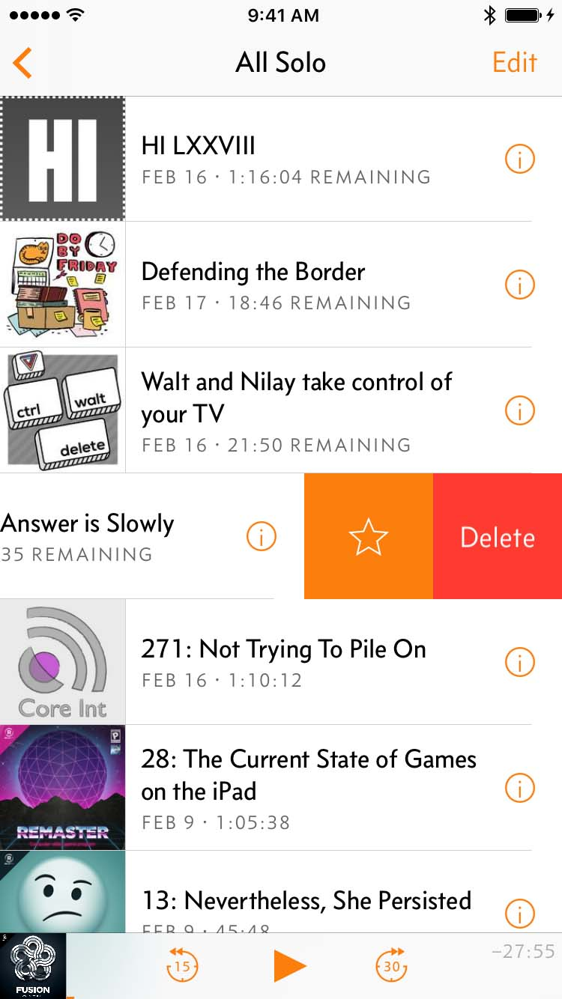

autoscale: true

11:00 am - 11:15 am: Introduction
11:15 am - 11:45 am: John Estropia - "Creating Keyboard Extensions on iOS"
11:45 am - 12:15 pm: Yoichi Tagaya - "More about Crashlytics and less about GDPR ;)"
12:15 pm - 1:00pm: Discussion

---

# Tokyo iOS Meetup
## May 2018

---

# Greet someone near you.

---

# ...

---

# Discussion

---

# Flutter

- https://flutter.io/
- Cross-platform UI framework created by Google.

---

# Swipe to Delete

- https://marco.org/2017/02/20/overcast3

---

---

# Other Topics?

---

# Upcoming

June 16th

- WWDC Theme

July 21st

- Presentations (2)

August

- Presentations (0)

---

# Is anyone looking to hire?

---

# Is anyone looking for work?

---

---

# Connect

- Twitter: @tokyoiosmeetup
- Facebook: Tokyo iOS Meetup
- YouTube: https://www.youtube.com/channel/UCqToSMJJrfsVjeQ9ATyu74Q
- Slack: https://tokyo-ios-meetup-slack-signup.herokuapp.com
- Github: tokyo-ios-meetup
