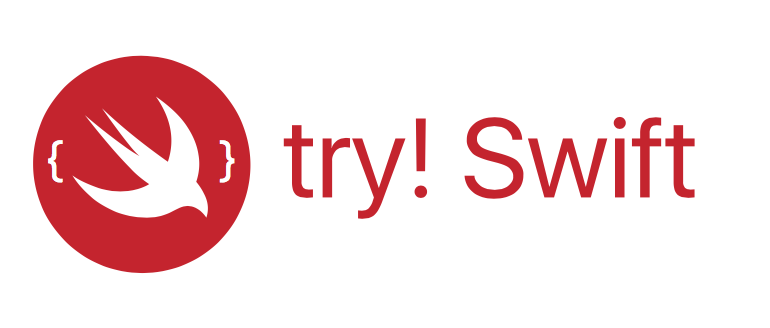

autoscale: true

11:10 am - 11:20 am: Alex Takahashi will present on "Helium"

11:20 am - 11:50 am: Kazunobu Tasaka will present on "Introduction to UIStackView"

11:50 am - 12:20 pm: Ben Guild will present on "Maintaining Modular UITableView(s), and Offline API Sync in 2016"

12:20 pm - 12:35 pm: Christopher Sisk will present on "Getting Started with a Development Career"

12:35 pm - 1:00 pm: Discussion

---

# December 2016 Tokyo iOS Meetup

---

# Greet someone near you.

---

# ...

---

# Call for Presentations

- Four-Slides / Four-Minutes Format

- SiriKit, Speech Recognition, etc.  We would like to see demostrations of some of the new Apple technologies.  Code samples, what it looks like, etc.

---

# Localization Team

We want to encourage more non-native speakers to give presentations in English.

- Help in proof-reading slides and transcripts
- Bilingual supporter who can answer questions during a presentation

---

# Video Team

- We are looking for one more person to help record the meetup.

---

- March 2nd, 3rd (Hackathon on the 4th)
- https://www.tryswift.co/tokyo/en
- Looking for sponsors

---

# Other Topics?

---

# Is anyone looking to hire?

---

# Is anyone looking for work?

---

# Thanks!

---

# Other Questions / Comments

---

# Connect

- Twitter: @tokyoiosmeetup
- Facebook: Tokyo iOS Meetup
- YouTube: https://www.youtube.com/channel/UCqToSMJJrfsVjeQ9ATyu74Q
- Slack: https://tokyo-ios-meetup-slack-signup.herokuapp.com

# Contribute

tokyo-ios-meetup (github)