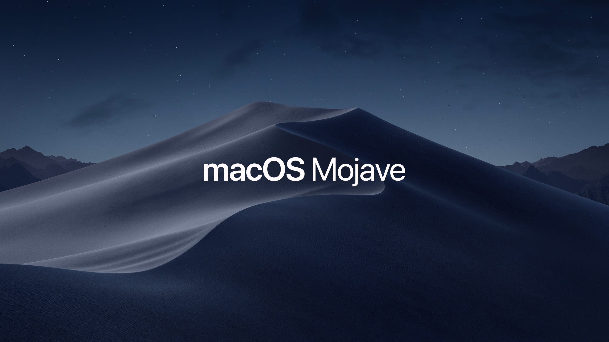
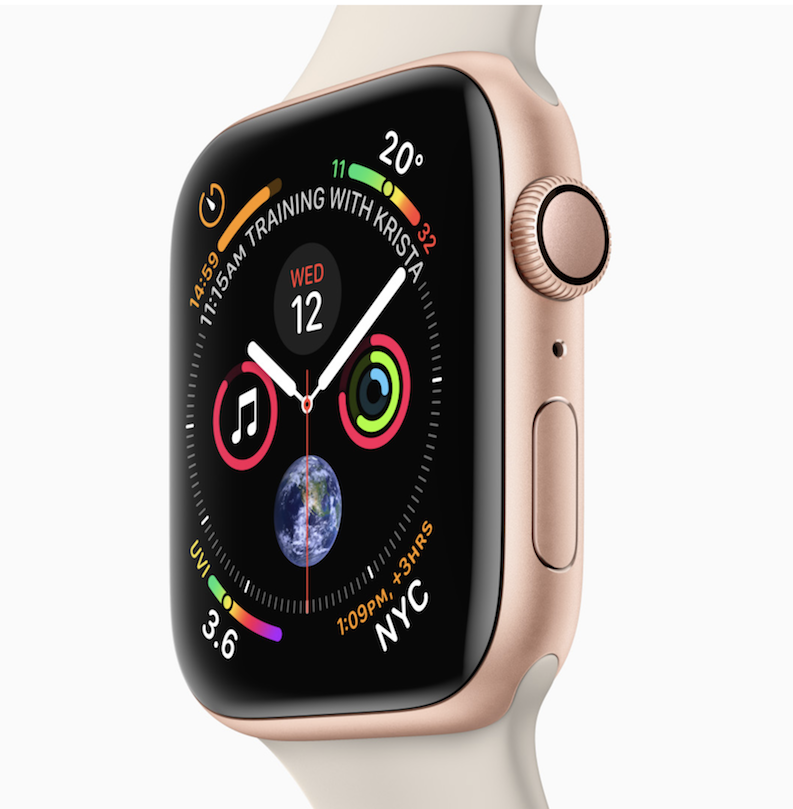

autoscale: true

11:00 am - 11:15 am: Introduction
11:15 am - 11:45 am: Mizuko Aoyagi - "My First iOS App"
11:45 am - 12:15 pm: Daisuke Nagata - "Using iOS 12's Portrait Matte"
12:15 pm - 1:00pm: Discussion

---

# Tokyo iOS Meetup
## October 2018

---

# Greet someone near you.

---

# ...

---

^ macOS Mojave Impressions

---

^ Apple Watch Series 4 Impressions

---

# Other Topics...

- iOS 12 Adoption Rate
- iOS 12.1 includes 70 new emoji
- iPhone XS Charging & LTE Problems

^ https://mixpanel.com/trends/#report/ios_12/from_date:-20,report_unit:day,to_date:0
^ As of Oct 5 - iOS 12: 47%; iOS 11: 45%
^ Anything else important in 12.1?

---

# Other Topics?

---

# Upcoming

November 17, 2018

- Presentations (0)

December 8, 2018

- Presentations (0)

---

# Is anyone looking to hire?

---

# Is anyone looking for work?

---

---

# Connect

- Twitter: @tokyoiosmeetup
- Facebook: Tokyo iOS Meetup
- YouTube: https://www.youtube.com/tokyoiosmeetup
- Slack: https://tokyo-ios-meetup-slack-signup.herokuapp.com
- Github: tokyo-ios-meetup
