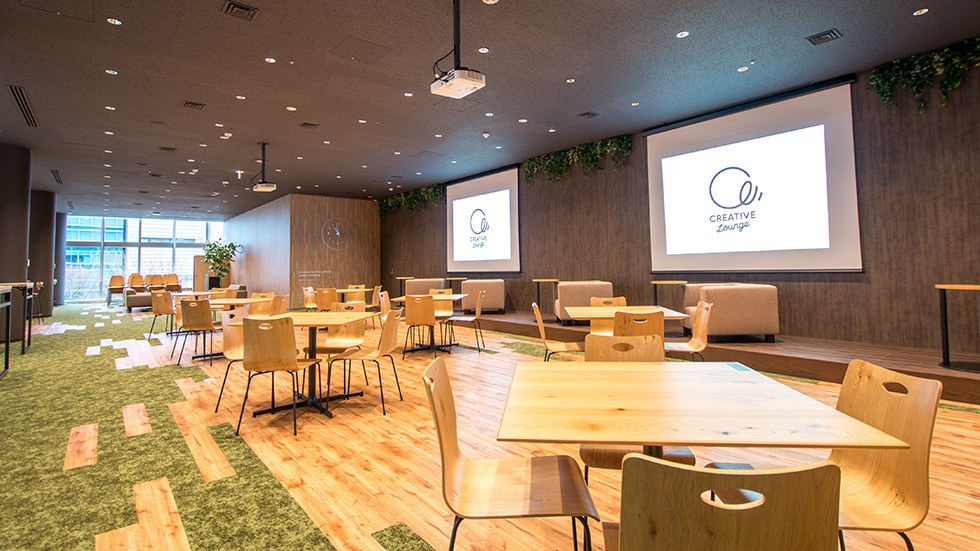
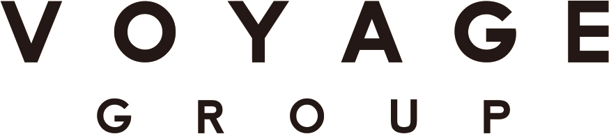

autoscale: true

11:00 am - 11:15 am: Introduction

11:15 am - 11:45 am: Bektur Ryskeldiev will present "Interactions in Mixed Reality or what is mixed reality and how can we make applications for it?".

11:45 am - 12:15 pm: Paul McMahon will present "All Code is Debt".

12:15 pm - 1:00pm: Discussion

---

# Tokyo iOS Meetup
## September 2017

---

# Greet someone near you.

---

# New Location

From next month, we will be start meeting in a new location:

- __Cyber Agent Creative Lounge 渋谷プライムプラザ (4F)
19, Maruyamacho, 1, Shibuya, Tokyo, JP__

- About one minute walk from our current location
- The doors may not always be open

---

# Meeting Time

- Do you have an opinion about the time of the meetup?
- Would it be better / worse to meet during a weekday evening?

## Let Derek or Matt know your preference.

---

# Video Team

- We are looking for one more member to record the meetup.

---

# Call for Presentations

- Four-Slides / Four-Minutes Format

- ARKit, SiriKit, CoreML, etc. We would like to see demonstrations of some of the new Apple technologies. Code samples, what it looks like, etc.

---

# Other Topics?

---

# Is anyone looking to hire?

---

# Is anyone looking for work?

---

---

# Other Questions / Comments

---

# Connect

- Twitter: @tokyoiosmeetup
- Facebook: Tokyo iOS Meetup
- YouTube: https://www.youtube.com/channel/UCqToSMJJrfsVjeQ9ATyu74Q
- Slack: https://tokyo-ios-meetup-slack-signup.herokuapp.com
- Github: tokyo-ios-meetup
