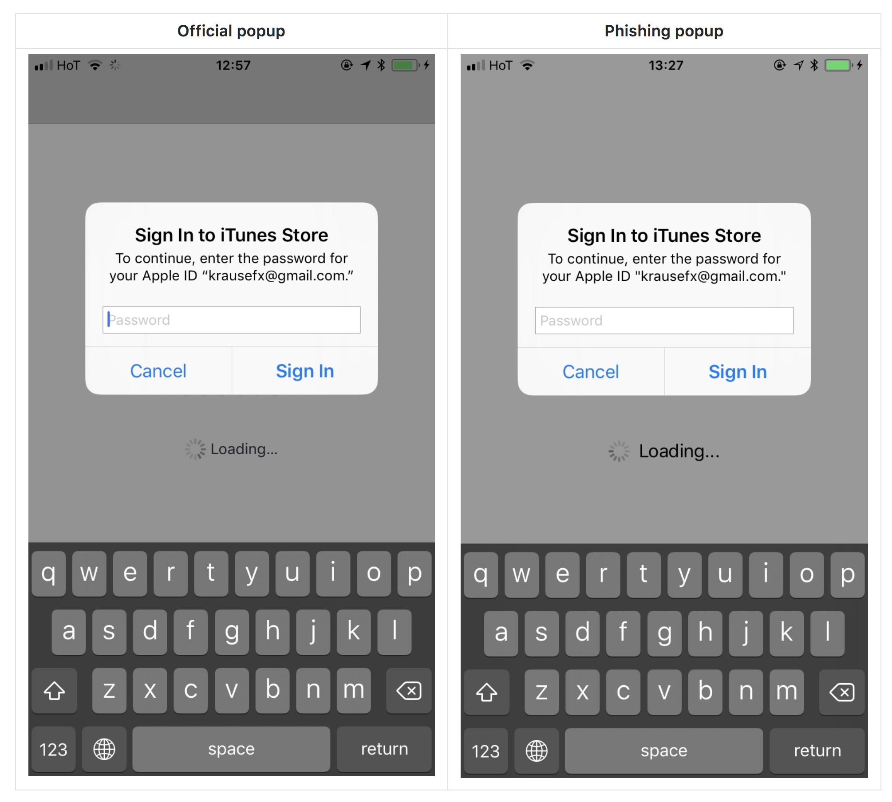

autoscale: true


11:00 am - 11:15 am: Introduction

11:15 am - 11:45 am: Peter Jacobs will present "Using Speech Kit for Voice Recognition."

11:45 am - 12:15 pm: John Estropia will present on "My Journey Taming Core Data: An Intro to the CoreStore Library."

12:15 pm - 1:00pm: Discussion

---

# Tokyo iOS Meetup
## October 2017

---

# Greet someone near you.

---

# ...

---

# Dictionary and Set Improvements in Swift 4.0

```swift
groceriesByDepartment[.bakery] == [🥐, 🍞]

let departmentCounts = groceriesByDepartment.mapValues { items in items.count }
departmentCounts[.bakery] == 2
```

https://swift.org/blog/dictionary-and-set-improvements

---

# Felix Krause Phishing Popup Blog Posts



https://krausefx.com/blog/ios-privacy-stealpassword-easily-get-the-users-apple-id-password-just-by-asking

---

# Swift drops in the TIOBE index

> Until recently it was quite common to program Android apps in Java and iOS apps in Swift/Objective-C. This is quite cumbersome because you have to maintain two code bases that are doing almost the same. So frameworks for mobile hybrid apps were developed and now that they have grown mature these are becoming very popular. Market leaders in this area are Microsoft’s Xamarin (C#), Apache’s Cordova (JavaScript) and Ionic (JavaScript). The consequences of all of this are that languages such as C# and JavaScript are gaining popularity at the cost of languages such as Java and Swift.

-- https://tiobe.com/tiobe-index/

---

# Call for Presentations

- Four-Slides / Four-Minutes Format

- ARKit, SiriKit, CoreML, etc. We would like to see demonstrations of some of the new Apple technologies. Code samples, what it looks like, etc.

---

# Other Topics?

---

# Is anyone looking to hire?

---

# Is anyone looking for work?

---


---

# Connect

- Twitter: @tokyoiosmeetup
- Facebook: Tokyo iOS Meetup
- YouTube: https://www.youtube.com/channel/UCqToSMJJrfsVjeQ9ATyu74Q
- Slack: https://tokyo-ios-meetup-slack-signup.herokuapp.com
- Github: tokyo-ios-meetup
